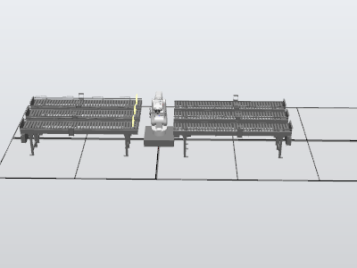
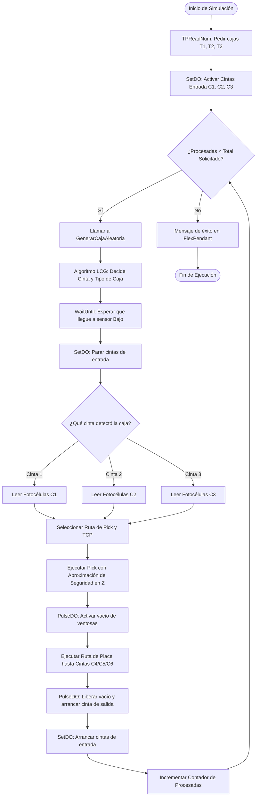

# Célula Robótica Automatizada de Clasificación con ABB IRB120
> **Proyecto de simulación y automatización industrial desarrollado en ABB RobotStudio**

[](https://new.abb.com/products/robotics/robotstudio)
[](https://new.abb.com/products/robotics/robotstudio)
[](https://www.autodesk.com/products/inventor/overview)
[](LICENSE)
[](https://www.ua.es/)

---

## 🌟 Descripción General

Este proyecto implementa una **Célula Virtual Automatizada de Clasificación y Pick & Place** totalmente autónoma empleando un brazo industrial **ABB IRB120**. Toda la estación, su comportamiento físico, sensores e inteligencia han sido simulados en **ABB RobotStudio** a través de **SmartComponents** y programados en lenguaje **RAPID**.

La célula está diseñada para procesar paquetería de forma dinámica. Mediante un sistema de fotocélulas dispuestas a diferentes alturas, la instalación identifica tres tipos de cajas que llegan de manera aleatoria a través de tres cintas transportadoras de entrada. El robot dispone de una **garra de vacío doble personalizada** diseñada a medida en 3D, la cual rota 180° sobre su eje para seleccionar la cara de ventosas adecuada en tiempo real antes de clasificar y evacuar cada caja en su respectiva cinta de salida.



---

## 📐 Layout de la Estación y Componentes

La distribución de la célula consta de **seis cintas transportadoras** dispuestas estratégicamente alrededor del rango de alcance máximo del robot IRB120 para optimizar tiempos de ciclo y trayectorias:

```
                  [Cinta 4] ---> (Cajas Tipo 3)
                  [Cinta 5] ---> (Cajas Tipo 2)
                  [Cinta 6] ---> (Cajas Tipo 1)
                        ^
                        | [Clasificación / Dejar]
                        |
                  [ABB IRB120] (Sobre Peana de 300mm)
                        ^
                        | [Recogida / Detección]
                        |
   (Entrada 1) <--- [Cinta 1]
   (Entrada 2) <--- [Cinta 2]
   (Entrada 3) <--- [Cinta 3]
```

### 1. Cintas Transportadoras
* **3 Cintas de Entrada (C1, C2, C3):** Situadas a la derecha del robot. Las cajas se generan de manera aleatoria en cualquiera de estas tres líneas.
* **3 Cintas de Salida (C4, C5, C6):** Situadas a la izquierda del robot. Cada una está destinada a un tipo específico de caja:
  * **Cinta 6 (C6):** Evacúa cajas de **Tipo 1**.
  * **Cinta 5 (C5):** Evacúa cajas de **Tipo 2**.
  * **Cinta 4 (C4):** Evacúa cajas de **Tipo 3**.

### 2. Especificaciones de las Cajas
El sistema está diseñado para clasificar tres tamaños de paquetes. Todos comparten una base de 100×100 mm pero varían en altura, lo cual permite su identificación óptica:

| Tipo de Caja | Altura (h) | Dimensiones (mm) | Línea de Evacuación | Cara de Garra Activa |
|---|---|---|---|---|
| **Tipo 1 (Pequeña)** | 50 mm | 100 × 100 × 50 | Cinta 6 | Cara A (3 Ventosas) |
| **Tipo 2 (Mediana)** | 80 mm | 100 × 100 × 80 | Cinta 5 | Cara B (4 Ventosas) |
| **Tipo 3 (Grande)** | 100 mm | 100 × 100 × 100 | Cinta 4 | Cara A (3 Ventosas) |

---

## 🛠️ Herramienta: Garra de Vacío Doble Personalizada

Para cumplir con las especificaciones del proceso, se diseñó desde cero una **Garra Doble Autocentrante** en **Autodesk Inventor**, exportada en formato `.stl` e integrada en RobotStudio.

```
       [TCP: Ventosas4] (4 Ventosas)  <--- Cara B   |   Cara A --->  [TCP: Ventosas3] (3 Ventosas)
                                          [Brida / Eje 6]
```

### Diseño e offsets de los TCP
La herramienta cuenta con dos caras funcionales opuestas a 180°, conectadas a la brida del eje 6 del robot:
* **Cara A (3 Ventosas):** Diseñada para manipular cajas de **Tipo 1** y **Tipo 3**.
  * *Tool Center Point (TCP):* `Ventosas3` (Offset local: `Y = +95 mm`)
* **Cara B (4 Ventosas):** Diseñada para manipular cajas de **Tipo 2**.
  * *Tool Center Point (TCP):* `Ventosas4` (Offset local: `Y = -95 mm`)

Al girar el eje 6 exactamente 180° (utilizando las posiciones articulares predefinidas `Inicio_V3` e `Inicio_V4`), el robot rota la herramienta al instante para orientar las ventosas adecuadas hacia la caja, garantizando un agarre estable y evitando colisiones mecánicas.

---

## 🧠 Componentes Inteligentes (SmartComponents) y Señales

La lógica física y la automatización dinámica de la célula se articulan a través de una red de **SmartComponents** vinculados a los canales de I/O digitales del controlador virtual mediante la Lógica de la Estación.

### Componente Inteligente de Cinta (Entrada)
Cada cinta de entrada cuenta con una arquitectura de SmartComponents que incluye:
* **3 Sources (Generadores):** Instancian los modelos 3D de las cajas en el extremo de la cinta.
* **1 Queue (Cola lógica):** Actúa como un embudo que organiza las cajas creadas para evitar superposiciones físicas.
* **1 LinearMover (Motor):** Desplaza físicamente la caja por la cinta a velocidad constante.
* **1 LogicSRLatch (Relé de Marcha/Paro):** La señal del programa en RAPID activa el latch para arrancar la cinta, y el sensor óptico en el extremo de recogida la detiene en seco (Reset).
* **3 LineSensors (Fotocélulas):** Situados a tres alturas específicas (Baja, Media, Alta) al final del recorrido.

### Matriz de Clasificación por Altura
El robot interpreta el tipo de caja analizando qué fotocélulas digitales (`Bajo`, `Medio`, `Alto`) se encuentran activadas:

| Sensor Bajo | Sensor Medio | Sensor Alto | Clasificación de Caja | Acción del Robot |
|:---:|:---:|:---:|---|---|
| **0** | **0** | **0** | Cinta vacía | Arranca cinta transportadora |
| **1** | **0** | **0** | **Tipo 1** (h = 50mm) | Frena cinta ➡️ Agarre con `Ventosas3` ➡️ Evacúa a C6 |
| **1** | **1** | **0** | **Tipo 2** (h = 80mm) | Frena cinta ➡️ Agarre con `Ventosas4` ➡️ Evacúa a C5 |
| **1** | **1** | **1** | **Tipo 3** (h = 100mm) | Frena cinta ➡️ Agarre con `Ventosas3` ➡️ Evacúa a C4 |

---

## 💻 Programación del "Cerebro" en RAPID

Toda la secuencia de movimiento e inteligencia de la célula está gobernada por un código **RAPID** estructurado en `src/Module1.mod`, dividido en bloques funcionales bien delimitados.

### 🎲 Generador Congruencial Lineal (LCG)
Dado que el lenguaje RAPID no cuenta de forma nativa con una función de aleatoriedad para simulaciones, se programó un algoritmo matematico de **Generador Congruencial Lineal (LCG)** para lograr la llegada aleatoria de paquetes:

$$X_{n+1} = (a \cdot X_n + c) \pmod{m}$$

*Con $a = 13$, $c = 7$, e $m = 1000$.* Al normalizar la semilla del ciclo entre `1, 2, 3`, el controlador determina al azar por qué cinta de entrada llegará el siguiente paquete y qué tipo de caja será, garantizando una producción dinámica e impredecible.

### 🔄 Diagrama de Flujo del Proceso
Flujo de ejecución secuencial en RAPID:



---

## ⚙️ Retos Técnicos Resueltos (Ingeniería de Detalle)

### 1. Singularidades Cinemáticas en Ejes 5 y 6
* **Problema:** Durante las pruebas en la Cinta 2, el robot reportaba fallos cinemáticos de singularidad al aproximarse en vertical a la caja, deteniendo la simulación por alineación lineal de articulaciones.
* **Solución:** En lugar de reubicar físicamente la cinta en el layout, se rotaron angularmente los puntos `pPick` y `pPick_App` en dicha cinta. Esto forzó al robot a inclinar levemente la garra al realizar el Pick, evitando la coincidencia de ejes y garantizando una trayectoria fluida en Z.

### 2. Auto-Interferencia de Sensores (Eje 6)
* **Problem:** Los sensores de colisión configurados en los SmartComponents del gripper detectaban falsamente el cuerpo físico del propio robot (`Link6`), activando el vacío a destiempo.
* **Solución:** Se editó el árbol de geometrías de la estación en RobotStudio para desactivar la propiedad **"Detectable por Sensores"** del componente físico `Link6` de la librería del IRB120, aislando ópticamente la garra de su actuador.

### 3. Rotación y Desviación de los TCP (Tool Center Points)
* **Problema:** Al rotar la garra 180° para cambiar de ventosas, el robot no mantenía los TCP alineados, produciendo un desfase espacial al coger la caja.
* **Solución:** Se reconstruyó el ensamblaje de la herramienta aplicando la matriz de rotación directamente sobre el origen local del modelo 3D `.stl` antes de definir los TCP `Ventosas3` y `Ventosas4`, asegurando precisión milimétrica en ambas caras.

---

## 🚀 Cómo Ejecutar la Simulación

### Requisitos Previos
* **ABB RobotStudio 7.0** o posterior instalado en Windows.
* Procesador multinúcleo y tarjeta gráfica dedicada para la fluidez física en 3D.

### Puesta en Marcha
1. **Clonar este repositorio:**
   ```bash
   git clone https://github.com/Alvarosudo/Pick-Place-Simulation-with-ABB-IRB120.git
   ```
2. **Abrir la Estación Pack & Go:**
   * Abre la carpeta `/robotstudio`.
   * Haz doble clic en el archivo `Practica3.rspag`.
   * RobotStudio importará automáticamente todas las geometrías, I/O configuradas, SmartComponents y el código de control.
3. **Iniciar la Simulación:**
   * En la pestaña **Simulación**, haz clic en el botón de **Play**.
   * Abre la pantalla del **FlexPendant** (HMI virtual).
   * Introduce la cantidad de cajas de cada tipo que deseas clasificar en el menú de pantalla.
4. **Verificar el funcionamiento:**
   * La célula comenzará su ciclo de clasificación de forma totalmente autónoma. Puedes consultar el archivo `/assets/video/simulation.mp4` para visualizar un vídeo pregrabado con el ciclo de trabajo completo.

---

## 📝 Licencia
Este proyecto se distribuye bajo la licencia **MIT**. Eres libre de utilizar los SmartComponents, la estructura del layout y los códigos en RAPID para fines académicos y profesionales. Consulta el archivo [LICENSE](LICENSE) para más detalles.

---

**Desarrollado con 🦾 por [Álvaro Antonio Quiles Ruiz](https://github.com/Alvarosudo)**
*Grado en Ingeniería Robótica - Universidad de Alicante (UA)*
