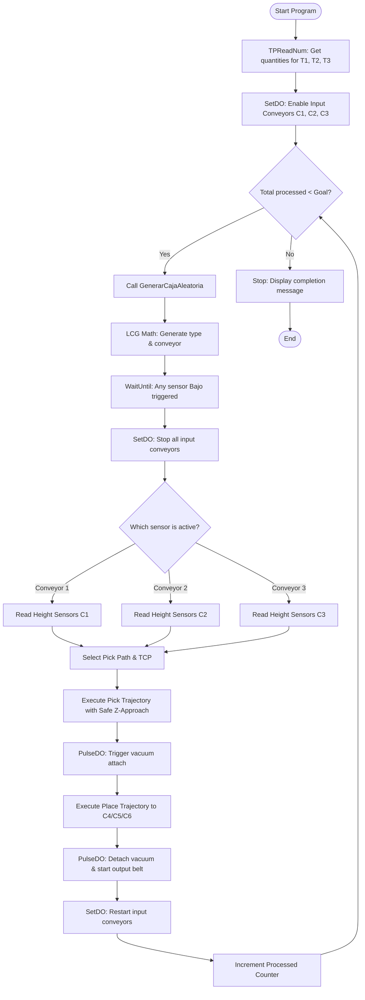

# Automated Classification Robotic Cell with ABB IRB120
> **An Industrial Pick & Place Simulation and Automation Project Developed in ABB RobotStudio**

[](https://new.abb.com/products/robotics/robotstudio)
[](https://new.abb.com/products/robotics/robotstudio)
[](https://www.autodesk.com/products/inventor/overview)
[](LICENSE)
[](https://www.ua.es/)

---

## 🌟 Overview

This project implements a fully autonomous, high-speed **Virtual Automated Classification and Sorting Cell** utilizing an **ABB IRB120** industrial robot arm. The entire station, logic, signals, and physics are simulated in **ABB RobotStudio** using **SmartComponents** and programmed in **RAPID**.

The cell is designed to handle packages dynamically, using height-based detection with photoelectric sensors to classify and sort three distinct box types arriving randomly across three input conveyor belts. The robot utilizes a **custom-designed dual suction gripper** that flips 180° to select the appropriate tool interface depending on the package type, placing it on the corresponding output conveyor.


---

## 📐 System Layout & Components

The workstation layout consists of **six conveyor belts** arranged around the robot's work envelope, engineered to maximize reachability and cycle time:

```
                  [Conveyor 4] ---> (Type 3 Boxes)
                  [Conveyor 5] ---> (Type 2 Boxes)
                  [Conveyor 6] ---> (Type 1 Boxes)
                        ^
                        | [Sorting / Place]
                        |
                  [ABB IRB120] (On 300mm Pedestal)
                        ^
                        | [Pick / Detection]
                        |
   (Input 1) <--- [Conveyor 1]
   (Input 2) <--- [Conveyor 2]
   (Input 3) <--- [Conveyor 3]
```

### 1. Conveyor Belts
* **3 Input Conveyors (C1, C2, C3):** Positioned to the right of the robot. Boxes are generated randomly in any of these three belts.
* **3 Output Conveyors (C4, C5, C6):** Positioned to the left of the robot. Each conveyor corresponds to a specific box type:
  * **Conveyor 6 (C6):** Evacuates **Type 1** boxes.
  * **Conveyor 5 (C5):** Evacuates **Type 2** boxes.
  * **Conveyor 4 (C4):** Evacuates **Type 3** boxes.

### 2. Box Specifications
The system is designed to sort three package sizes. All packages share a footprint of 100×100 mm but differ in height, enabling height-based classification:

| Box Type | Height (h) | Dimensions (mm) | Evacuation Line | Target Gripper Face |
|---|---|---|---|---|
| **Type 1 (Small)** | 50 mm | 100 × 100 × 50 | Conveyor 6 | Face A (3 Suction Cups) |
| **Type 2 (Medium)** | 80 mm | 100 × 100 × 80 | Conveyor 5 | Face B (4 Suction Cups) |
| **Type 3 (Large)** | 100 mm | 100 × 100 × 100 | Conveyor 4 | Face A (3 Suction Cups) |

---

## 🛠️ End-Effector: Custom Dual Suction Gripper

To satisfy the task requirements, a custom **Dual-Face Suction Gripper** was designed from scratch in **Autodesk Inventor** and integrated as an `.stl` tool inside RobotStudio.

```
       [TCP: Ventosas4] (4 Cups)  <--- Face B   |   Face A --->  [TCP: Ventosas3] (3 Cups)
                                        [Flange / J6]
```

### Gripper Design & TCP Offsets
The tool features two active grabbing faces positioned 180° apart, connected to the robot's Axis 6 flange:
* **Face A (3 Suction Cups):** Optimized for **Type 1** and **Type 3** boxes. 
  * *Tool Center Point (TCP):* `Ventosas3` (Offset in Tool Frame: `Y = +95 mm`)
* **Face B (4 Suction Cups):** Optimized for **Type 2** boxes.
  * *Tool Center Point (TCP):* `Ventosas4` (Offset in Tool Frame: `Y = -95 mm`)

By rotating Axis 6 by 180° (using Joint targets `Inicio_V3` and `Inicio_V4`), the robot flips the tool instantly to align the appropriate suction cups with the box target, preventing tool interference and ensuring solid contact simulation.

---

## 🧠 SmartComponents & Signal Logic

To make the environment dynamic and responsive, the physical components utilize a rich network of **SmartComponents** linked to the robot controller's digital I/Os via Station Logic.

### Conveyor SmartComponent Logic
Each input conveyor operates as an independent subsystem featuring:
* **3 Sources:** Generate box geometry dynamically at the start of the belt.
* **1 Queue:** Collects the generated objects and feeds them sequentially into the conveyor motor.
* **1 LinearMover:** The conveyor motor that drives the physical movement of the boxes.
* **1 LogicSRLatch:** A flip-flop actuator acting as a start/stop relay. A digital run signal from RAPID sets the latch, and the photoelectric sensor resets the latch to stop the conveyor.
* **3 LineSensors:** Positioned at three strategic heights (Low, Medium, High) at the end of each conveyor belt.

### Classification Matrix
The robot identifies box sizes using the combinatorics of the three line sensors (`Bajo`, `Medio`, `Alto`):

| Sensor Bajo (Low) | Sensor Medio (Med) | Sensor Alto (High) | Box Classification | Actuator Action |
|:---:|:---:|:---:|---|---|
| **0** | **0** | **0** | No box present | Conveyor runs |
| **1** | **0** | **0** | **Type 1** (50mm height) | Stop Conveyor ➡️ Pick with `Ventosas3` ➡️ Place to C6 |
| **1** | **1** | **0** | **Type 2** (80mm height) | Stop Conveyor ➡️ Pick with `Ventosas4` ➡️ Place to C5 |
| **1** | **1** | **1** | **Type 3** (100mm height) | Stop Conveyor ➡️ Pick with `Ventosas3` ➡️ Place to C4 |

---

## 💻 Control Logic & RAPID Programming

The entire automation flow is managed by a structured **RAPID** program. It manages user configuration, handles dynamic randomization, checks sensor states, coordinates motion trajectories, and triggers pneumatic grippers.

### 🎲 Pseudo-Random Package Generation (LCG)
Since the RAPID language does not include a native random number generator, a **Linear Congruential Generator (LCG)** mathematical algorithm was programmed to distribute box generations randomly:

$$X_{n+1} = (a \cdot X_n + c) \pmod{m}$$

*Where $a = 13$, $c = 7$, and $m = 1000$.* The output seed is normalized to values `1, 2, 3` to determine which conveyor will receive a box, and which box type is created, ensuring full randomness of arrival. 

### 🔄 Program Flowchart
Below is the execution flow implemented in `src/Module1.mod`:



---

## ⚙️ Engineering Challenges & Workarounds

### 1. Kinematic Singularities in Axis 5 & 6
* **Problem:** During simulation testing, specific approach points on Conveyor 2 triggered wrist singularities, halting the robot because joint coordinates were aligning linearly.
* **Solution:** Instead of modifying the physical conveyor placement, the `pPick` and `pPick_App` target frames on Cinta 2 were rotated by an angular offset. This allowed the dual gripper to access the box from a different approach angle, maintaining the physical position of the boxes while eliminating the singularity.

### 2. Physical Sensor Self-Interference (Link 6)
* **Problem:** The pneumatic collision sensors placed on the gripper were constantly triggering FALSE POSITIVES by colliding with the robot's own Axis 6 housing.
* **Solution:** In the CAD/Simulation model inside RobotStudio, the physical properties of `Link6` were edited to disable the **"Detectable by Sensors"** attribute. This isolated the physical interaction exclusively to the tool's gripper faces and the box geometries.

### 3. Tool Rotation Alignment (TCP Drift)
* **Problem:** When rotating the gripper physical geometry by 180° to switch faces, the Tool Center Points (TCP) were not rotating synchronously, causing positional drift.
* **Solution:** Re-authored the tool assembly from scratch by applying the rotation matrix directly to the local origin of the 3D `.stl` geometry prior to defining the tool and TCP frames in RobotStudio.

---

## 🚀 How to Run the Simulation

### Prerequisites
* **ABB RobotStudio 7.0** (or later) installed on Windows.
* Dual-core CPU with a dedicated GPU for 3D physics rendering.

### Getting Started
1. **Clone this repository:**
   ```bash
   git clone https://github.com/Alvarosudo/Pick-Place-Simulation-with-ABB-IRB120.git
   ```
2. **Open the Pack & Go Station:**
   * Navigate to the `/robotstudio` folder.
   * Double-click on `Practica3.rspag`.
   * RobotStudio will extract all geometries, smart components, I/O maps, and controller configurations automatically.
3. **Start the Virtual Controller:**
   * Go to the **Simulation** tab and click **Play**.
   * Open the **FlexPendant** window (controller HMI).
   * Enter the production demands via the virtual FlexPendant screen (e.g., number of T1, T2, and T3 boxes).
4. **Watch the Simulation:**
   * The program will execute. Check `/assets/video/simulation.mp4` for a compressed pre-recorded demonstration.

---

## 📝 License
This project is licensed under the **MIT License**. Feel free to use the RAPID logic, SmartComponent structures, and CAD assets for educational and professional robotics development. See the [LICENSE](LICENSE) file for details.

---

**Developed with 🦾 by [Álvaro Antonio Quiles Ruiz](https://github.com/Alvarosudo)**
*Degree in Robotics Engineering - Universidad de Alicante (UA)*
